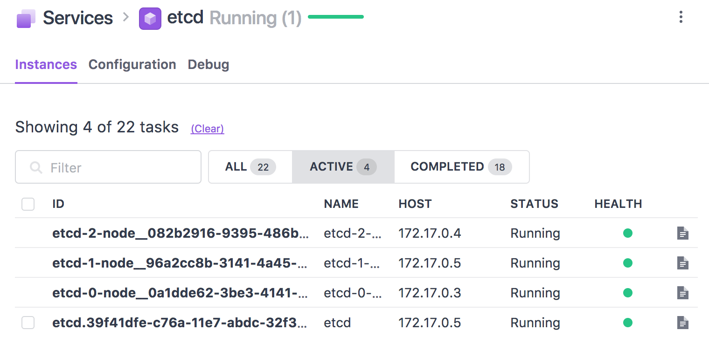

ETCD Scheduler for DC/OS
------------------------

# Etcd scheduler for DC/OS



* etcd client endpoint: `client.<etcd-frameworkname>.l4lb.thisdcos.directory:2379`

# How to use 
## Build
```bash
$ cd frameworks/etcd/
$ ./build.sh
```

## Use Universe

* Serve `frameworks/etcd/build/distributions/*.zip` files in httpd.
* Serve `sdk/bootstrap/bootstrap` file in httpd.
* Copy `frameworks/etcd/universe/*` to `universe/repo/B/beta-etcd/0/*`
* Replace file assets in `resource.json` with:
```json
    {
      "jre-tar-gz": "https://downloads.mesosphere.com/java/jre-8u131-linux-x64-jce-unlimited.tar.gz",
      "libmesos-bundle-tar-gz": "https://downloads.mesosphere.io/libmesos-bundle/libmesos-bundle-1.10-1.4-63e0814.tar.gz"
    }
``` 

* Replace `bootstrap` asset in `resource.json` with proper location.
* Replcae `scheduler-zip` asset in `resource.json` with proper location.
* Replcae `executor-zip` asset in `resource.json` with proper location.

* Build local universe.

## Use pre-built docker image

* Use `minyk/dcos-etcd:dev` from Docker hub, and marathon.json(frameworks/etcd/docker/marathon.json).
* Dockerfile: 
```dockerfile
FROM centos:7.3.1611

RUN yum install -y unzip tar && mkdir -p /usr/share/dcos

COPY etcd-scheduler.zip /usr/local/dcos/etcd-scheduler.zip
COPY executor.zip /usr/local/dcos/executor.zip
COPY bootstrap.zip /usr/local/dcos/bootstrap.zip
COPY libmesos-bundle-1.10-1.4-63e0814.tar.gz /usr/local/dcos/libmesos-bundle-1.10-1.4-63e0814.tar.gz
COPY jre-8u131-linux-x64-jce-unlimited.tar.gz /usr/local/dcos/jre-8u131-linux-x64-jce-unlimited.tar.gz
COPY entrypoint.sh /entrypoint.sh

ENV JAVA_URI http://api.etcd.marathon.l4lb.thisdcos.directory/v1/files/jre-8u131-linux-x64-jce-unlimited.tar.gz
ENV LIBMESOS_URI http://api.etcd.marathon.l4lb.thisdcos.directory/v1/files/libmesos-bundle-1.10-1.4-63e0814.tar.gz
ENV EXECUTOR_URI http://api.etcd.marathon.l4lb.thisdcos.directory/v1/files/executor.zip
ENV BOOTSTRAP_URI http://api.etcd.marathon.l4lb.thisdcos.directory/v1/files/bootstrap.zip

ENTRYPOINT ["/entrypoint.sh"]

```

# Limitations
* ETCD Docker image is static: `quay.io/coreos/etcd:v3.2`
* ETCD node count is static: `3`
* Scheduler does not provide cli extension.
* ~~Scheduler does not provide endpoint to etcd. You can find etcd at `etcd-0-node.<framework-name>.autoip.dcos.thisdcos.directory`.~~
* Scheduler does not provide a way to configure etcd servers.
